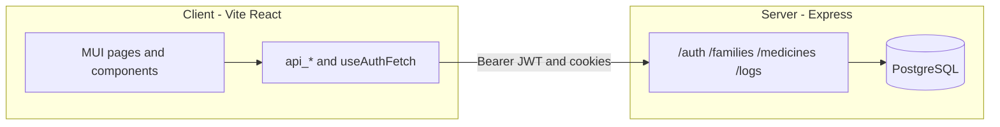
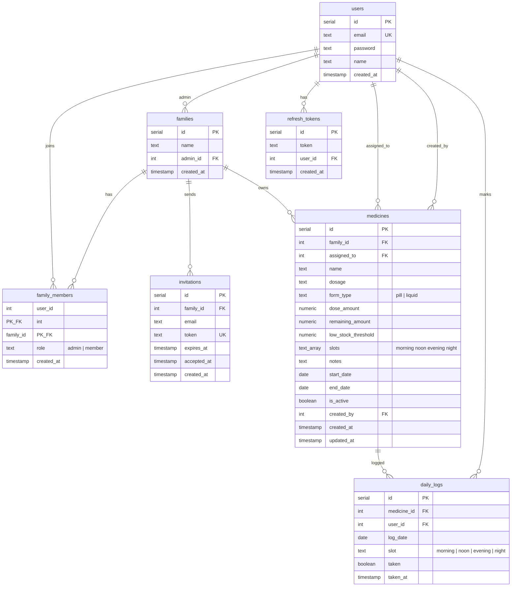

# MedAlert

Family medication scheduling and daily adherence tracking. Users register, create or join families, assign medicines to members with time-of-day slots, and mark doses on a shared dashboard. Admins can invite members and view a family-wide overview of today’s adherence.

## Features (implemented)

- **Authentication** — Register, login, JWT access tokens, httpOnly refresh cookies, refresh, and logout (`/auth`).
- **Families** — Create families, list memberships, fetch family details, and view a **today** overview of each member’s slot progress (`/families`, `/families/:id/overview`).
- **Invitations** — Email-based invite tokens, accept via link, finalize after login/register; admins manage pending invites and remove members (`/families/:id/invite`, accept/finalize flow, Members page).
- **Medicines** — CRUD for family medicines: assign to a member, morning/noon/evening/night slots, pill or liquid form, dosage, remaining supply and low-stock threshold (`/medicines`).
- **Dashboard** — Date navigation, per-slot checklist, adherence metrics, optimistic toggle for dose logs (`/logs`, Dashboard page).
- **Roles** — Family **admin** vs **member** (admin-only invite and member management).

## Tech stack

| Layer | Technologies |
|-------|----------------|
| **Client** | React 19, TypeScript, Vite 7, MUI 9, Tailwind CSS 4, React Router 7, Day.js |
| **Server** | Express 5, Node.js, `pg` (PostgreSQL), bcrypt, jsonwebtoken, cookie-parser, cors |
| **Database** | PostgreSQL |

## Architecture



The SPA talks to the API with `Authorization: Bearer <access_token>` and sends cookies on refresh/logout. Protected routes use server-side JWT middleware.

## Database schema

Canonical DDL lives in `server/src/util/create_db.js` (`npm run db:create`). Incremental changes may also appear in `server/src/util/migrate.js`.



| Table | Notes |
|-------|--------|
| `daily_logs` | One row per medicine, date, and slot; `UNIQUE (medicine_id, log_date, slot)`. |
| `medicines` | `slots` is a PostgreSQL `TEXT[]` subset of `morning`, `noon`, `evening`, `night`. |
| `family_members` | Composite primary key `(user_id, family_id)`. |

## Repository layout

```
MedAlert/
├── client/                 # Vite + React SPA
│   └── src/
│       ├── api/            # HTTP helpers (families, medicines, logs, invites)
│       ├── pages/          # Route-level views (Dashboard, Medications, …)
│       ├── components/     # Shared UI
│       └── hooks/          # e.g. useAuthFetch, useFamilyRole
└── server/                 # Express API
    └── src/
        ├── controllers/    # Request handlers
        ├── routes/         # Route definitions
        ├── middleware/     # Auth
        ├── config/         # Env-backed config
        └── util/           # DB pool, db:create, db:migrate
```

## Prerequisites

- **Node.js** (LTS recommended)
- **PostgreSQL** running locally (or reachable from the server)
- Two terminals for local development (server + client)

## Getting started

1. **Create a PostgreSQL database**  
   Default database name used by the server is `myapp` (override with `DB_NAME`).

2. **Server** (`server/`)

   ```bash
   cd server
   # Create .env (see Environment variables)
   npm install
   npm run db:create      # drops/recreates schema; seeds optional local test users
   npm run db:migrate     # optional; for existing DBs that need column updates
   npm run dev            # http://localhost:3000
   ```

   `db:create` is destructive for app tables in the target database. Use only in local development.

3. **Client** (`client/`)

   ```bash
   cd client
   # Create .env (see Environment variables)
   npm install
   npm run dev            # default http://localhost:5173
   ```

4. Open the client URL in the browser, register or use seeded test accounts from `db:create` if you rely on that script locally.

`.env` files are gitignored; do not commit secrets.

## Environment variables

| Location | Variable | Purpose |
|----------|----------|---------|
| server | `ACCESS_TOKEN_SECRET` | JWT signing secret (**required**; server exits if missing) |
| server | `REFRESH_TOKEN_SECRET` | Refresh token secret (**required**) |
| server | `DB_USER` | Postgres user (default `postgres`) |
| server | `DB_PASSWORD` | Postgres password (default `postgres`) |
| server | `DB_HOST` | Postgres host (default `localhost`) |
| server | `DB_PORT` | Postgres port (default `5432`) |
| server | `DB_NAME` | Database name (default `myapp`) |
| server | `APP_URL` | Frontend origin for invite links (default `http://localhost:5173`) |
| client | `VITE_PUBLIC_API_HOST` | API base URL (e.g. `http://localhost:3000`) |

Example server `.env`:

```env
ACCESS_TOKEN_SECRET=your-access-secret
REFRESH_TOKEN_SECRET=your-refresh-secret
DB_NAME=myapp
APP_URL=http://localhost:5173
```

Example client `.env`:

```env
VITE_PUBLIC_API_HOST=http://localhost:3000
```

## API overview

Base URL: `http://localhost:3000` (development). Most routes require `Authorization: Bearer <access_token>` except where noted.

| Method | Path | Description |
|--------|------|-------------|
| **Auth** | | |
| POST | `/auth/register` | Create account |
| POST | `/auth/login` | Login; sets refresh cookie |
| POST | `/auth/refresh` | New access token (cookie) |
| POST | `/auth/logout` | Logout (authenticated) |
| **Families** | | |
| GET | `/families` | List user’s families |
| POST | `/families` | Create family |
| GET | `/families/:id` | Family details |
| GET | `/families/:id/overview` | Today’s adherence overview |
| POST | `/families/:id/invite` | Invite by email (admin) |
| GET | `/families/:id/invitations` | Pending invitations |
| DELETE | `/families/:id/invitations/:invitationId` | Cancel invitation |
| DELETE | `/families/:id/members/:userId` | Remove member |
| GET | `/families/accept-invite/:token` | Validate invite token (public) |
| POST | `/families/finalize-invite` | Complete invite after auth |
| **Medicines** | | |
| GET | `/medicines` | List (scoped by family membership) |
| POST | `/medicines` | Create |
| PUT | `/medicines/:id` | Update |
| DELETE | `/medicines/:id` | Delete |
| **Logs** | | |
| GET | `/logs` | Dose logs (query params for date/family) |
| POST | `/logs` | Create or update a dose log |

## Scripts

**Server** (`server/package.json`):

| Script | Description |
|--------|-------------|
| `npm run dev` | Start API with `--watch` on port 3000 |
| `npm run db:create` | Initialize schema (+ local test users) |
| `npm run db:migrate` | Apply incremental SQL migrations |
| `npm run build` | Copy `src/` to `dist/` |
| `npm start` | Run `dist/index.js` |

**Client** (`client/package.json`):

| Script | Description |
|--------|-------------|
| `npm run dev` | Vite dev server |
| `npm run build` | Typecheck + production build |
| `npm run preview` | Preview production build |
| `npm run lint` | ESLint |

## Roadmap and limitations

- **Reports** — UI placeholder only; no reporting API yet.
- **Reminders** — No push notifications or scheduled email reminders in the backend; any reminder messaging on the marketing/welcome UI is not a shipped feature.

## Author

Backend package metadata: [mgudwilowicz](https://github.com/mgudwilowicz).
